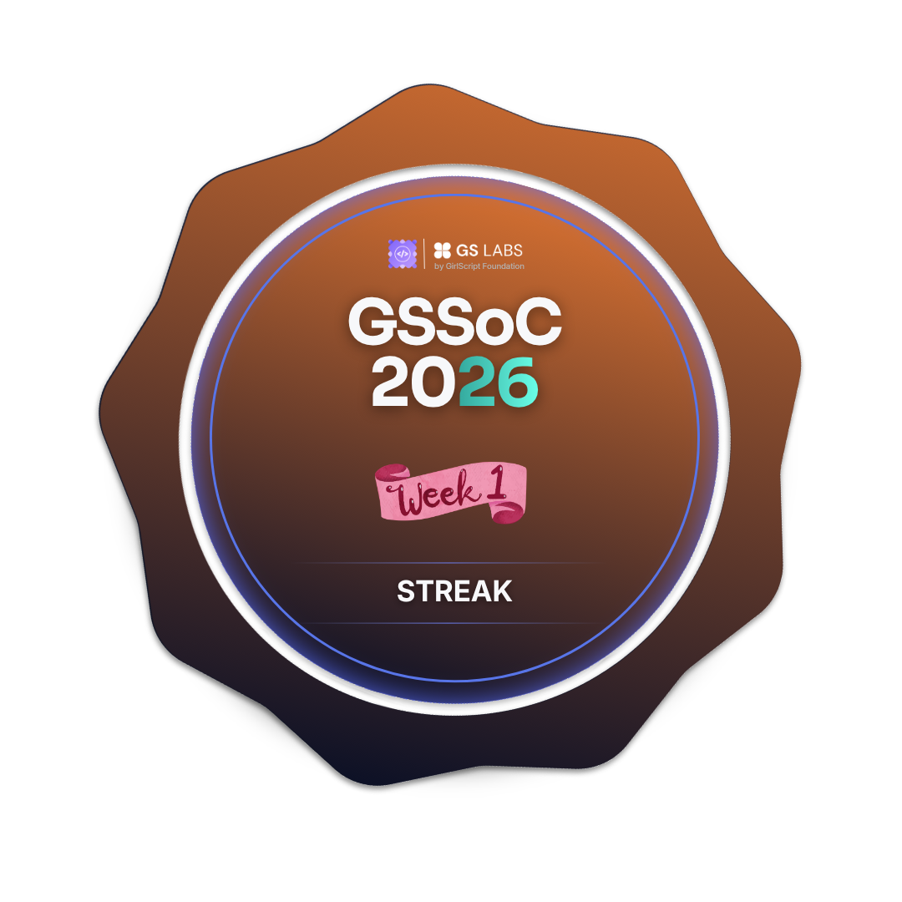

<h1 align="center">Hi 👋, I'm Joicy Roslin</h1>

<h3 align="center">
AI/ML Developer | Generative AI Enthusiast | Open Source Contributor
</h3>

Passionate about building AI-powered applications, solving real-world problems using Machine Learning, Deep Learning, and Generative AI, while continuously learning and contributing to open source.

---

## 🚀 About Me

- 🎓 College Student passionate about AI & Machine Learning
- 🤖 Currently learning Deep Learning, NLP, Generative AI, and Computer Vision
- 💡 Building real-world AI projects and open-source contributions
- 🌱 Exploring LLMs, RAG, LangChain, and AI Agents
- 💻 Open Source Contributor in programs like GSSoC'26 and NSoC'26
- 🎯 Goal: Become an AI Engineer by 2027
- 📫 Reach me at: **joicyroslin@gmail.com**

---

## 🛠️ Tech Stack

### 👨‍💻 Languages

### 🤖 AI / ML

### 📚 Libraries & Frameworks

### 🌐 Tools & Platforms

---

## 🌟 Featured Projects

### 🎬 AI Viral Clip Generator
AI-powered tool that generates engaging viral clips automatically using AI workflows and automation.

### 🧠 AI Support Intelligence Hub
Multi-domain AI support assistant capable of handling and routing customer support queries intelligently.

### 🎙️ Nova Voice Assistant
Voice-enabled AI assistant capable of performing tasks through speech interaction.

### 📧 Spam Email Detection
Machine Learning model that classifies emails as spam or ham using NLP preprocessing techniques.

### ✋ AetherTouch AI
Computer Vision-based hand gesture and virtual mouse control system using OpenCV and hand tracking.

---

## 📈 Current Focus

- Deep Learning
- Generative AI
- LangChain & RAG
- AI Agents
- Computer Vision
- Open Source Contributions
- DSA in Python

---

## 🏆 Achievements

- 🌟 Contributor at GirlScript Summer of Code 2026
- 🌟 Contributor at Nexus Spring of Code 2026
- 💼 Machine Learning Intern
- 🚀 Building real-world AI projects consistently

## 🏆 GSSoC'26 Badges

  
  
  
  
  
  
  

  <b>GirlScript Summer of Code 2026 Contributor</b> 
  Top 4% globally • 7 badges earned • Open-source contributor

  <a href="https://gssoc.girlscript.org/profile/f08f7518-1faa-4d40-a8a4-2cf85e788321">
    View my GSSoC'26 Profile
  </a>

---

## 📊 GitHub Stats

  

  

---

## 🌐 Connect With Me

---

<h3 align="center">
✨ “Building AI solutions one project at a time.” ✨
</h3>
